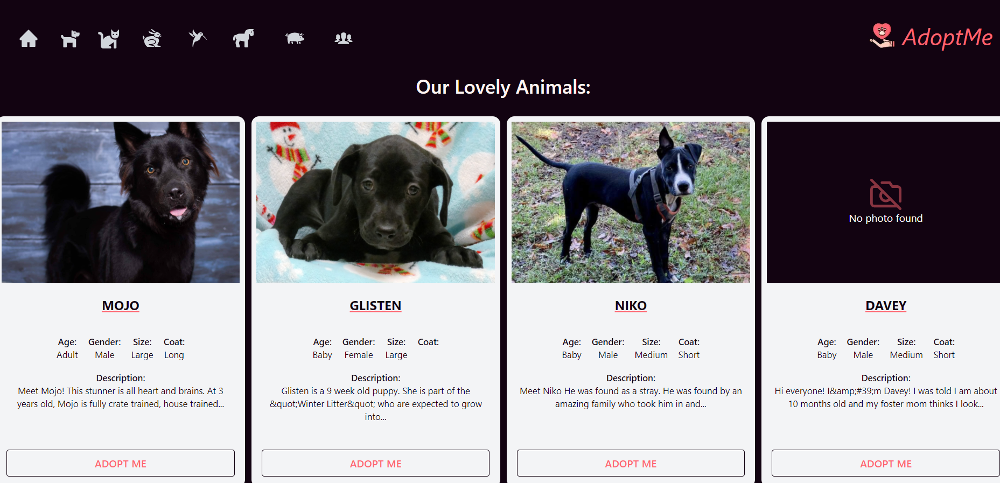
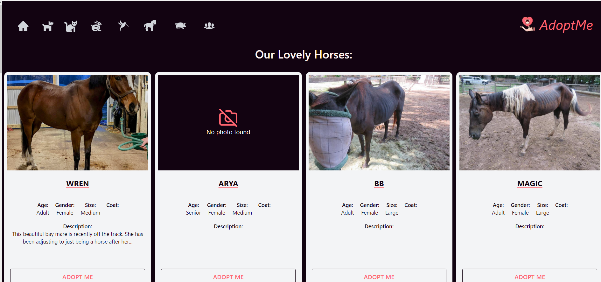
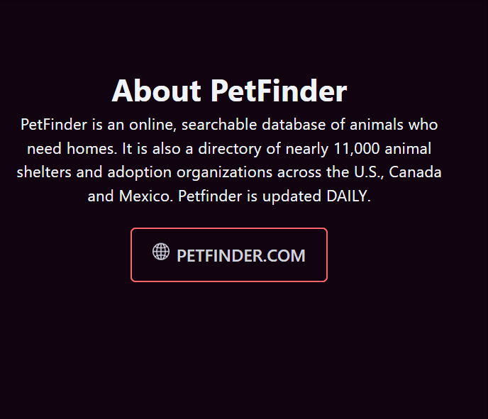
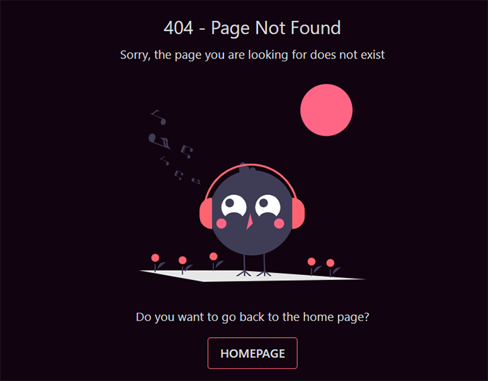
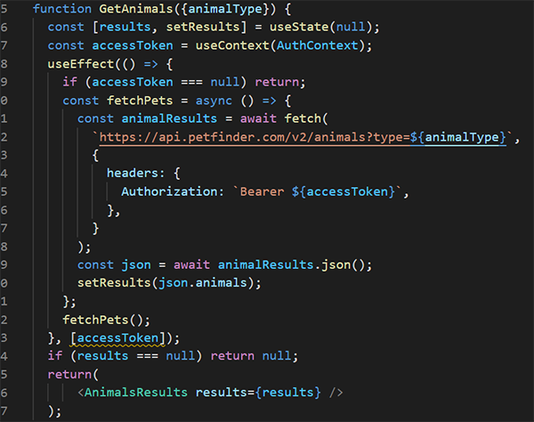
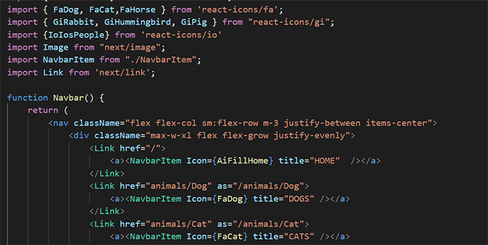
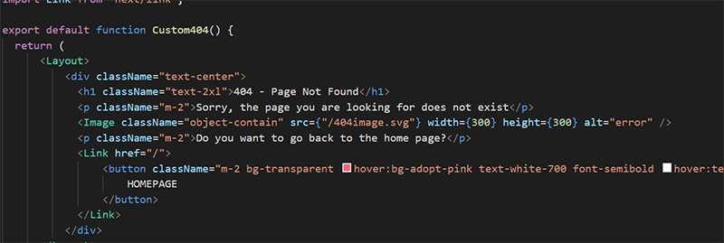

# AdoptMe

* [Informacje wstępne](#Informacje-wstępne)
* [Technologie i narzędzia](#Technologie-i-narzędzia)
* [Interfejs](#Interfejs)
* [Opis realizacji projektu](#Opis-realizacji-projektu)

## Informacje wstępne

Przedmiot: Aplikacje webowe dla urządzeń mobilnych oraz Technologie formatkowe

Rok akademicki: 2021/2022

Grupa: S32-32

Skład zespołu: Justyna Gapys, Natalia Skórowska 

Nazwa aplikacji: Adopt Me

Frontend: React

Framework CSS: Tailwind

Cel aplikacji: Aplikacja "Adopt me" umożliwia przegląd katalogu ze zwierzętami, które czekają na adopcję. Wykorzystane API jest aktualizowane codziennie, dzięki temu na stronie głównej aplikacja wyświetla informacje o dwudziestu ostatnio dodanych zwierzętach. Istnieje także możliwość filtrowania zwierząt ze względu na 6 rodzajów: psy, koty, króliki, ptaki, konie oraz zwierzęta gospodarskie. Poprzez naciśnięcie na dane zwierzę użytkownik przekierowany zostaje do strony, z której może dokonać jego adopcji.

## Technologie i narzędzia

|ID | Nazwa | Zastosowanie | Wersja |
| ------------- | ------------- |------|------|
| 1 | React  | Frontend - wykorzystanie useState, useEffect, createContext | 17.0.2 |
| 2 | Next.js  | Routing w aplikacji (zamiast react router) - wykorzystanie next/image, next/link, next/router | 12.0.7 |
| 3 | Tailwind  | FrameworkCSS - własne stylowanie, zdefiniowane własne kolory oraz animacje elementów np. ruchome ikony w panelu nawigacji | 3.0.7 |
| 4 | React icons  | Ikony znajdujące się w zakładce 'About Us' oraz w panelu nawigacyjnym | 4.3.1 |
| 5 | React Simple-Image-Slider  | Karuzela ze zdjęciami w zakładce 'About Us' | 2.3.0 |
| 6 | React Tooltip  | Tooltip  ukazujący się po najechaniu na button w zakładce 'About Us' | 4.2.21 |
| 7 | Material UI  | Cardy znajdujące się w zakładce 'About Us', Grid na stronie głównej, CircularProgress | 4.11.2 |
| 8 | API  | PetFinder - katalog zwierząt do adopcji | - |
| 8 | IDE  | Visual Studio Code | - |

## Interfejs

Interfejs aplikacji AdoptMe jest responsywny.

Strona główna:

Panel nawigacyjny:

Strona danego gatunku:

Zakładka About Us:

Slider ze zdjęciami zwierząt z każdej kategorii w zakładce 'About Us':

Tooltip ukazujący się po najechaniu na przycisk:

Animacja ikony w wypadku braku zdjęcia zwierzaka:

CircularProgress wyświetlający się podczas ładowania strony:

Dedykowana strona błędu:

## Opis realizacji projektu

1.Stworzenie React App, logo aplikacji oraz podpięcie wybranego api wraz z kluczami w pliku oauth-token.js.

2.Zaimplementowanie funkcji GetAnimals odpowiedzialnej za pobieranie  danych o ostatnio dodanych zwierzętach wraz z uwzględnieniem danego gatunku zwierząt.

3.Konfiguracja mechanizmu routingu z wykorzystaniem Next.js oraz stworzenie panelu nawigacyjnego:

4.Stylowanie strony głównej z wykorzystaniem Tailwinda
- Wykorzystanie Grida z Reacta celem odpowiedniego ustawienia "kafelek" ze zwierzętami
- Na stronie głównej jednorazowo wyświetla się 20 ostatnio dodanych zwierząt, kafelek z pojedynczym zwierzęciem zawiera jego zdjęcie, imię, informację o płci, wieku i wielkości oraz krótki opis jeśli taki został dodany.
- Po naciśnięciu na button "Adopt me" przy danym zwierzaku użytkownik zostaje przekierowany do strony danego zwierzeka na portalu petfinder.com gdzie można dokonać adopcji.
- Pulsująca React Icon pojawiająca się gdy nie ma zdjęcia zwierzęcia.

5.Stworzenie globalnego koloru tła i własnych kolorów, styli z użyciem Tailwinda

6.Stworzenie dedykowanej strony błędu:

7. Stylowanie zakładki 'About Us':
- Slider ze zdjęciami wszystkich gatunków zwierząt dostępnych do adopcji. Karuzela za zdjęciami zmienia się sama, ale można tego dokonać także ręcznie
- 4 Cardy zawierające informacje o PetFinder. W nich zastosowane react-icons oraz gradient na tło nagłówka
- Przycisk "Petfinder.com", który po naciśnięciu przenosi użytkownika na stronę główną petfinder.com
- Do wyżej opisanego przycisku zaimplementowany Tooltip wyświetlający się po najechaniu na przycisk

